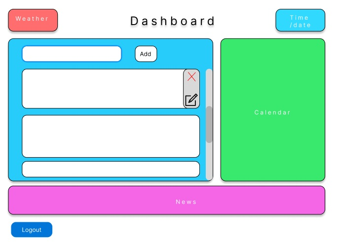
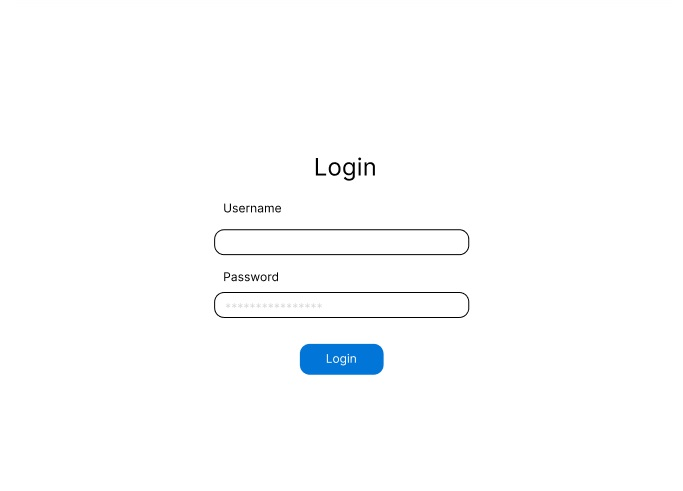

# My Dashboard

This is a versatile **Dashboard Application** that includes the following features:  
- **Login Page**: Secure access with user authentication.  
- **News**: Stay updated with the latest news.  
- **To-Do List**: Organize tasks with an interactive to-do list.
- **Calendar**: ~~Keep track of important dates and events.~~ `TBD`
- **Today's Weather**: View current weather information.  

## Features
- Responsive design for seamless use across devices.
- Dynamic data fetching for real-time updates.
- Clean and intuitive user interface.

## Technologies Used
- **Frontend**: React, TypeScript, Bootstrap CSS.
- **Backend**: Express.js.
- **APIs**: News API, Weather API.

## Dashboard in action

## Links
- [Repo](https://github.com/DebugBob/My_Dashboard)
-  Deployed website link